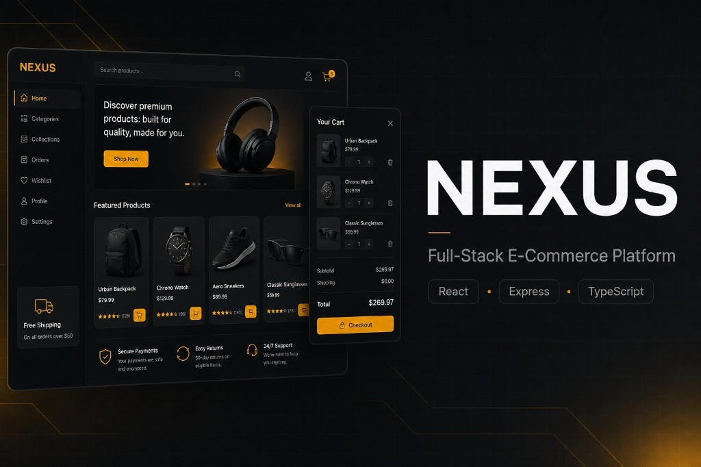
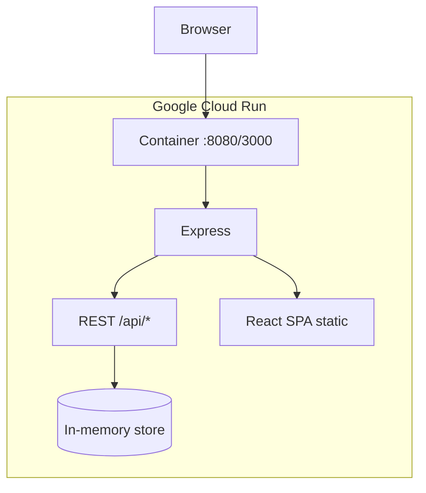

# NEXUS — Full-Stack E-Commerce Platform

[](https://full-stack-e-commerce-platform-668971334330.europe-west2.run.app)
[](https://react.dev)
[](https://expressjs.com)
[](https://www.typescriptlang.org)
[](https://tailwindcss.com)

**NEXUS** is a production-style full-stack e-commerce application: a premium dark storefront for shoppers and a merchant admin console for catalog, orders, analytics, and simulated payments—deployed on **Google Cloud Run** and built with **React**, **Express**, and **TypeScript** in a single codebase.

<p align="center">
  <a href="https://full-stack-e-commerce-platform-668971334330.europe-west2.run.app">
    
  </a>
</p>

<p align="center">
  <strong>
    <a href="https://full-stack-e-commerce-platform-668971334330.europe-west2.run.app">→ Open live demo</a>
  </strong>
  &nbsp;·&nbsp;
  <a href="#features">Features</a>
  &nbsp;·&nbsp;
  <a href="#quick-start">Run locally</a>
  &nbsp;·&nbsp;
  <a href="#api-reference">API</a>
</p>

---

## About the project

NEXUS demonstrates how a modern e-commerce product can be structured end-to-end without splitting into separate frontend and backend repositories. One **Express** server hosts REST APIs and, in development, **Vite** middleware; in production it serves the built **React** SPA from the same origin—simplifying deployment (as on Cloud Run) and avoiding CORS friction.

The customer experience includes catalog discovery, variant selection (size/color), persistent cart and wishlist, promo codes, and a checkout flow modeled after **Stripe** (payment intents, webhook idempotency, stock validation). The **Admin Panel** exposes revenue analytics, conversion funnels, order lifecycle management, refunds with inventory restoration, and full product CRUD.

| | |
|---|---|
| **Live app** | [full-stack-e-commerce-platform-668971334330.europe-west2.run.app](https://full-stack-e-commerce-platform-668971334330.europe-west2.run.app) |
| **Repository** | [github.com/mkkbun/Full-Stack-E-Commerce-Platform](https://github.com/mkkbun/Full-Stack-E-Commerce-Platform) |
| **Stack** | React 19 · Express 4 · TypeScript · Tailwind CSS 4 · Vite 6 |
| **Deploy target** | Google Cloud Run (europe-west2) |

> **Sandbox mode:** Orders and catalog data use an **in-memory store** (resets when the instance restarts). A **Prisma + PostgreSQL** schema under `api/prisma/` is included as the planned persistence layer.

---

## Features

### Storefront (customer)

- Product grid with search, categories, and curated collections  
- Product detail modal with image gallery, ratings, and variant stock  
- Cart drawer with quantity controls and promo code **`WELCOME10`** (10% off)  
- Checkout with address autocomplete, tax/shipping breakdown, and simulated card payment  
- Order history and tracking timeline (by profile email)  
- Wishlist synced via `localStorage`  

### Admin (merchant)

- **Telemetry dashboard** — revenue, AOV, weekly charts, top products, conversion funnel  
- **Order ops** — status updates (`PENDING` → `PROCESSING` → `SHIPPED` → `DELIVERED`), tracking numbers, refunds  
- **Catalogue CRUD** — create, edit, and delete products with variants  
- Simulated **Stripe** webhook handling with **idempotent** event processing  

### Engineering

- Shared TypeScript types across UI and API  
- REST API with filtering, sorting, and stock-aware checkout  
- Single-command dev server; production build bundles client + server  

---

## Tech stack

| Layer | Technologies |
|-------|----------------|
| **Frontend** | React 19, TypeScript, Tailwind CSS 4, Motion, Lucide React, Recharts |
| **Backend** | Node.js, Express 4 |
| **Tooling** | Vite 6, tsx, esbuild |
| **Hosting** | Google Cloud Run |
| **Planned** | PostgreSQL + Prisma (`api/prisma/schema.prisma`) |

---

## Quick start

### Prerequisites

- Node.js **18+** (20+ recommended)  
- npm  

### Run locally

```bash
git clone https://github.com/mkkbun/Full-Stack-E-Commerce-Platform.git
cd Full-Stack-E-Commerce-Platform
npm install
npm run dev
```

Open [http://localhost:3000](http://localhost:3000).

No `.env` file is required for the default demo. See [`.env.example`](.env.example) for optional variables.

### Production build

```bash
npm run build
NODE_ENV=production npm start
```

| Script | Description |
|--------|-------------|
| `npm run dev` | Express + Vite (development) |
| `npm run build` | Build SPA + server bundle |
| `npm start` | Run `dist/server.cjs` |
| `npm run lint` | TypeScript check |

---

## Try the live demo

| Step | Action |
|------|--------|
| 1 | Visit the [live app](https://full-stack-e-commerce-platform-668971334330.europe-west2.run.app) |
| 2 | Add products to cart; use promo **`WELCOME10`** in the cart drawer |
| 3 | Complete checkout with any mock card details |
| 4 | Open **Admin Panel** → dashboard & catalogue CRUD |
| 5 | Under **Profile**, set email to `audrey@vance.net` to view sample order history |

---

## API reference

**Production base URL:** `https://full-stack-e-commerce-platform-668971334330.europe-west2.run.app`  
**Local base URL:** `http://localhost:3000`

### Products

| Method | Endpoint | Description |
|--------|----------|-------------|
| `GET` | `/api/products` | List/filter: `category`, `search`, `minPrice`, `maxPrice`, `sortBy`, `rating` |
| `GET` | `/api/products/:id` | Single product |
| `POST` | `/api/products` | Create (admin) |
| `PUT` | `/api/products/:id` | Update (admin) |
| `DELETE` | `/api/products/:id` | Delete (admin) |

### Orders & checkout

| Method | Endpoint | Description |
|--------|----------|-------------|
| `GET` | `/api/orders` | List orders |
| `PUT` | `/api/orders/:id/status` | Update status / tracking |
| `POST` | `/api/orders/refund` | Refund + restore stock |
| `POST` | `/api/checkout/intent` | Payment intent + pending order |
| `POST` | `/api/checkout/webhook-simulate` | Idempotent webhook simulation |

### Analytics

| Method | Endpoint | Description |
|--------|----------|-------------|
| `GET` | `/api/analytics` | Revenue, funnel, top products, charts |

```bash
curl "https://full-stack-e-commerce-platform-668971334330.europe-west2.run.app/api/products?search=backpack"
```

---

## Project structure

```text
├── server.ts                    # Express API, in-memory data, Vite/static
├── api/prisma/schema.prisma     # Future PostgreSQL models
├── api/src/modules/products/    # Products controller
├── src/
│   ├── App.tsx
│   ├── types.ts
│   └── components/              # Storefront, cart, checkout, admin
├── docs/showcase.png            # README hero image
└── package.json
```

---

## Architecture



**Checkout flow:** `POST /api/checkout/intent` → stock check & order creation → `POST /api/checkout/webhook-simulate` (idempotent) → admin fulfillment & optional refund.

---

## Roadmap

- [ ] Wire Prisma to PostgreSQL  
- [ ] Real Stripe keys and webhooks  
- [ ] User authentication (schema ready)  
- [ ] Docker / CI pipeline docs  

---

## License

Apache License 2.0 — see [Apache-2.0](https://www.apache.org/licenses/LICENSE-2.0) (`SPDX-License-Identifier: Apache-2.0` in source files).

---

## Credits

- Product photos — [Unsplash](https://unsplash.com)  
- Icons — [Lucide](https://lucide.dev)  
