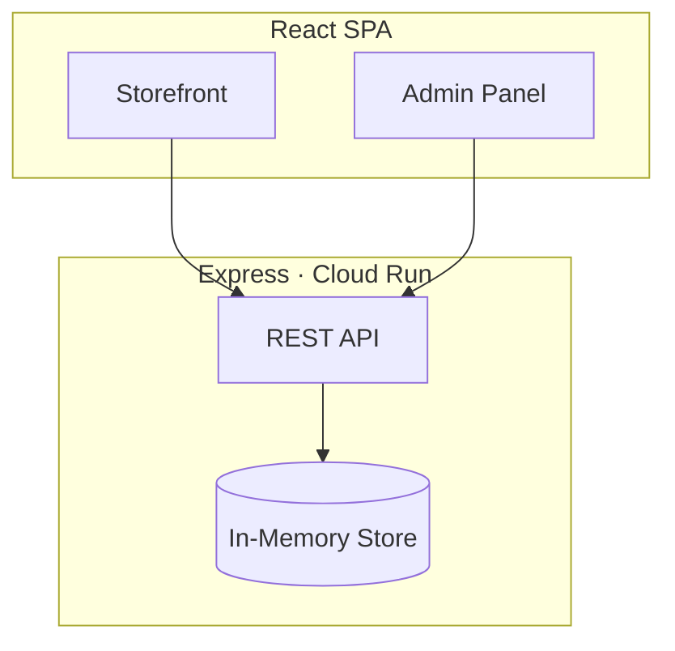

<div align="center">


# NEXUS — Full-Stack E-Commerce Platform

**Production-style e-commerce with a customer storefront, merchant admin panel, and simulated Stripe checkout — deployed live on Google Cloud Run.**

[](https://full-stack-e-commerce-platform-668971334330.europe-west2.run.app)
[](https://github.com/mkkbun/Full-Stack-E-Commerce-Platform)
[](https://www.typescriptlang.org/)
[](https://react.dev/)
[](https://expressjs.com/)
[](https://vitejs.dev/)
[](https://tailwindcss.com/)

**[View Live Application](https://full-stack-e-commerce-platform-668971334330.europe-west2.run.app)** · **[Repository](https://github.com/mkkbun/Full-Stack-E-Commerce-Platform)**

</div>

---

## Live Demo

| | |
|---|---|
| **URL** | [https://full-stack-e-commerce-platform-668971334330.europe-west2.run.app](https://full-stack-e-commerce-platform-668971334330.europe-west2.run.app) |
| **Hosting** | Google Cloud Run (Europe West 2) |
| **Stack** | React 19 · Express · Vite · TypeScript · Tailwind CSS |

### Try it in 60 seconds

1. Open the **[live demo](https://full-stack-e-commerce-platform-668971334330.europe-west2.run.app)** — browse the **Storefront** catalogue.
2. Add a product (pick size/color) → open the cart → apply promo **`WELCOME10`** for 10% off.
3. Complete checkout with any mock card details (sandbox mode).
4. Switch to **Admin** in the header → view analytics, manage orders, or edit products in CRUD.

---

## About

**NEXUS** is a portfolio-ready full-stack e-commerce application built as a single Express + Vite monolith. It demonstrates real-world patterns: REST APIs, variant inventory, cart persistence, checkout with stock validation, simulated Stripe payment intents & webhooks (with idempotency), refunds with stock restoration, and a merchant analytics dashboard.

| View | What you get |
|------|----------------|
| **Storefront** | Search, filters, product variants, cart, checkout, promo codes |
| **Admin** | Revenue charts, order fulfillment, refunds, product CRUD |

> Data runs in an **in-memory store** (resets on server restart). A [Prisma schema](./api/prisma/schema.prisma) is included for future PostgreSQL integration.

---

## Screenshots

| Storefront | Admin Dashboard |
|:----------:|:---------------:|
| Browse catalogue, filters, and product details | Analytics, orders, Stripe-style refund flow |
| *Open [live demo](https://full-stack-e-commerce-platform-668971334330.europe-west2.run.app) → Storefront* | *Switch header to Admin → Telemetry Dashboard* |

---

## Features

### Customer Storefront

- Product catalogue with search, category, price, rating filters, and sorting
- Product detail modal — size/color variants with live stock
- Cart persisted in `localStorage`
- Promo code **`WELCOME10`** (10% off)
- Checkout — address autocomplete (mock), tax, free shipping over $200
- Simulated Stripe payment intents and webhook confirmation

### Merchant Admin

- **Telemetry Dashboard** — revenue, AOV, funnel, top products, weekly charts (Recharts)
- **Orders** — status updates, tracking numbers, refunds
- **Catalogue CRUD** — create, update, delete products with variants

### Backend

- REST API with `ProductsController` (filtering, search, sort)
- Stock checks at checkout · webhook idempotency · seed data for demos

---

## Tech Stack

| Layer | Technologies |
|-------|----------------|
| **Frontend** | React 19, TypeScript, Tailwind CSS 4, Motion, Lucide React, Recharts |
| **Backend** | Express 4, TypeScript (tsx) |
| **Build** | Vite 6, esbuild |
| **Deploy** | Google Cloud Run |
| **Data** | In-memory (runtime) · Prisma + PostgreSQL (schema ready) |

---

## Architecture



---

## Getting Started

### Prerequisites

- Node.js **18+** (20 LTS recommended)
- npm

### Local development

```bash
git clone https://github.com/mkkbun/Full-Stack-E-Commerce-Platform.git
cd Full-Stack-E-Commerce-Platform
npm install
npm run dev
```

Open **http://localhost:3000** — no API keys or database required.

### Production build

```bash
npm run build
NODE_ENV=production npm start
```

---

## API Reference

| Method | Endpoint | Description |
|--------|----------|-------------|
| `GET` | `/api/products` | List/filter products |
| `GET` | `/api/products/:id` | Product by ID |
| `POST` | `/api/products` | Create product |
| `PUT` | `/api/products/:id` | Update product |
| `DELETE` | `/api/products/:id` | Delete product |
| `GET` | `/api/orders` | List orders |
| `PUT` | `/api/orders/:id/status` | Update order status |
| `POST` | `/api/checkout/intent` | Create payment intent |
| `POST` | `/api/checkout/webhook-simulate` | Simulate Stripe webhook |
| `POST` | `/api/orders/refund` | Refund order |
| `GET` | `/api/analytics` | Dashboard metrics |

**Order statuses:** `PENDING` · `PROCESSING` · `SHIPPED` · `DELIVERED` · `REFUNDED`

---

## Project Structure

```
├── api/prisma/schema.prisma
├── api/src/modules/products/products.controller.ts
├── docs/assets/                    # README showcase images
├── src/components/                 # React UI
├── server.ts                       # Express + API + seed data
└── package.json
```

---

## Scripts

| Command | Description |
|---------|-------------|
| `npm run dev` | Dev server (port 3000) |
| `npm run build` | Production build |
| `npm start` | Run production server |
| `npm run lint` | TypeScript check |

---

## Author

**[mkkbun](https://github.com/mkkbun)** — Full-Stack E-Commerce Platform

- **Live:** [full-stack-e-commerce-platform-668971334330.europe-west2.run.app](https://full-stack-e-commerce-platform-668971334330.europe-west2.run.app)
- **Repo:** [github.com/mkkbun/Full-Stack-E-Commerce-Platform](https://github.com/mkkbun/Full-Stack-E-Commerce-Platform)

---

## License

[Apache License 2.0](https://www.apache.org/licenses/LICENSE-2.0)

---

<p align="center">
  <a href="https://full-stack-e-commerce-platform-668971334330.europe-west2.run.app"><strong>▶ View Live Demo</strong></a>
</p>
